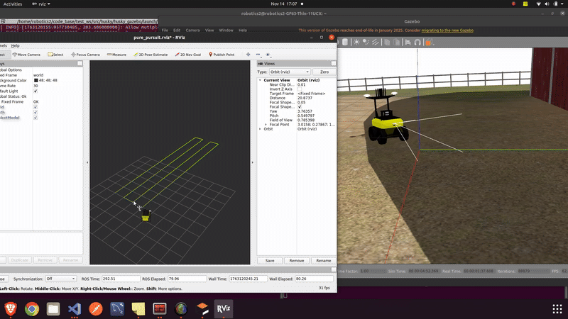

# Husky with Pure Pursuit (v1)

This repository contains the Husky simulation integrated with a Pure Pursuit controller for GPS-based path following.

---

## Tested Environment

| Component | Version |
|----------|---------|
| ROS | **ROS Noetic** |
| Ubuntu | **20.04** |
| Gazebo | Default bundled with ROS Noetic |

---

## Workspace Setup

If you don't already have a catkin workspace:

```bash
mkdir -p ~/ros_ws/src
cd ~/ros_ws/src
```

Build the workspace:

```bash 
cd ~/ros_ws
catkin_make
```

## Install Gazebo Models

Clone the gazebo model repository into the workspace:

```bash
cd ~/ros_ws/src
git clone git@github.com:akrbot/gazebo_models.git
```

Add the model folder to the Gazebo model search path:

```bash 
echo 'export GAZEBO_MODEL_PATH=$GAZEBO_MODEL_PATH:~/ros_ws/src/gazebo_models' >> ~/.bashrc
source ~/.bashrc
```

Launch the Simulation

Run the Husky simulation with the agricultural environment:

```bash
roslaunch husky_gazebo husky_custom_world.launch launch_type:=agriculture
```
Running Pure Pursuit Modules

Run the following commands in separate terminals (or tmux):

1️⃣ Publish Robot Pose from Dual GPS
```bash
roslaunch pure_pursuit dual_gps_pose.launch
```

⚙️ This node fuses dual-antenna GPS input to publish accurate robot position and heading.

2️⃣ Publish a Pre-Defined Path
```bash
rosrun pure_pursuit path_publisher.py
```

📍 This script loads and publishes a predefined navigation path for the robot to follow.

3️⃣ Start Pure Pursuit Control Node
```bash
rosrun pure_pursuit pure_pursuit_node.py
```

🚜 This node computes steering and velocity commands to follow the published path.



